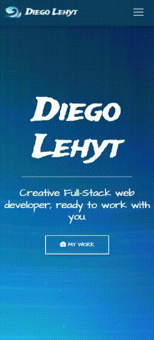

# React Portfolio-v2.1     

- Link to Deploy Portfolio, at the end. [>> GO ⬇️ <<](#url)

#### Portfolio version 2.0!


#### All Pages


## 📌Table of Content

* [Description](#description)
* [Installation](#installation)
* [Usage](#usage)
* [Test](#test)
* [Contributing](#contributing)
* [License](#license)
* [Details](#details)
* [Features](#features)
* [URL](#url)
* [Questions](#questions)

## 📋Description
Diego Lehyt Portfolio updated with lates projects using React framework.


## 💿Installation
Clone the repository

## 🤝Contributing
Feel free to pull request and give me your suggestions if any.
          
## ⚖️License  
This project is under the MIT License.

## 📑Details

This repository was created using ```npm create-react-app```, plus all components and pages needed in order to create my portfolio.

## 📀Features
- Burger menu on small screens.

  

- Portfolio Cards.

  

## 🔗URL  

- Portfolio Demo on youtube "https://youtu.be/dmdBDokwQ_s"
- The URL to this repo page is "https://github.com/diegolehyt/React-Portfolio.git"
- Deploy Portfolio Here! --> "https://diegolehyt.github.io/React-Portfolio/" <--

## 👤Questions  
     


✉️ E-mail: diegolehy00@gmail.com
